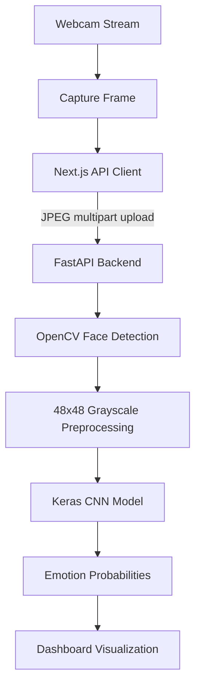

# 🧠 EmotionAI — Real-Time Facial Expression Recognition

<p align="center">
  <strong>An end-to-end computer vision platform that detects visible facial expressions through a webcam and presents predictions in a modern web dashboard.</strong>
</p>

<p align="center">
  <a href="https://emotion-detector-henna.vercel.app">Live Demo</a> •
  <a href="https://emotion-detector-backend-26w2.onrender.com/docs">API Documentation</a> •
  <a href="https://github.com/AhmedMuarij/Emotion_Detector">Source Code</a>
</p>


## 📌 Overview

EmotionAI is a full-stack machine learning application built around a custom Convolutional Neural Network (CNN) trained on a balanced subset of the FER2013 dataset. The system captures webcam frames in the browser, sends images to an asynchronous FastAPI backend, performs face localization and model inference, and returns emotion probabilities to a responsive Next.js dashboard.

> **Important:** The model predicts visible facial expression patterns based on dataset annotations. It does not determine a person's internal emotional state, intentions, mental health, or personality.

## ✨ Features

- 🎥 Real-time webcam inference with lightweight frame sampling
- 👤 Face localization using OpenCV Haar Cascade
- 🧠 Custom Keras CNN trained on FER2013
- 😊 Five supported classes: Happy, Surprise, Neutral, Angry, and Sad
- 📊 Confidence score and per-class probability visualization
- ⚡ Asynchronous FastAPI inference API
- 🔒 Privacy-focused processing with no image retention by design
- ☁️ Cloud deployment using Render and Vercel
- 📚 Interactive Swagger/OpenAPI documentation

## 🚀 Live Services

| Service | Platform | Link |
|---|---|---|
| Frontend Dashboard | Vercel | [Open application](https://emotion-detector-henna.vercel.app) |
| Backend API | Render | [Health check](https://emotion-detector-backend-26w2.onrender.com/health) |
| API Documentation | Swagger/OpenAPI | [Open docs](https://emotion-detector-backend-26w2.onrender.com/docs) |

## 📈 Model Performance

The current balanced CNN version is documented with **62.54% overall test accuracy** on a held-out FER2013 evaluation set.

| Expression | Recall / Accuracy |
|---|---:|
| Happy | 86.0% |
| Surprise | 80.4% |
| Neutral | 68.0% |
| Angry | 38.5% |
| Sad | 30.4% |
| **Overall** | **62.54%** |

These metrics should be interpreted as benchmark results on the evaluation data, not as a guarantee of real-world accuracy across different lighting conditions, faces, cultures, or environments.

## 🏗️ System Architecture



## 📂 Project Structure

```text
Emotion_Detector/
├── backend/        # FastAPI application, routes, inference and tests
├── frontend/       # Next.js + TypeScript dashboard
├── ml/             # Preprocessing, training and evaluation pipeline
├── models/         # Trained model and metadata
├── shared/         # Shared project resources
├── docs/           # Documentation and project assets
├── .env.example
├── pytest.ini
└── README.md
```

## 🛠️ Local Setup

### Requirements

- Python 3.10 or 3.11
- Node.js 18+
- Git LFS

### 1. Clone the repository

```bash
git clone https://github.com/AhmedMuarij/Emotion_Detector.git
cd Emotion_Detector
git lfs pull
```

### 2. Run the backend

```bash
python -m venv .venv

# Windows
.venv\Scripts\activate

# macOS/Linux
# source .venv/bin/activate

pip install -r backend/requirements.txt
cd backend
uvicorn app.main:app --reload --host 127.0.0.1 --port 8000
```

Backend: `http://127.0.0.1:8000`  
Swagger docs: `http://127.0.0.1:8000/docs`

### 3. Run the frontend

Open a second terminal:

```bash
cd frontend
npm install
```

Create `frontend/.env.local`:

```env
NEXT_PUBLIC_API_BASE_URL=http://localhost:8000
```

Then start the app:

```bash
npm run dev
```

Frontend: `http://localhost:3000`

### 4. Run tests

```bash
pytest backend/tests -v
```

## 📡 API Endpoints

| Method | Endpoint | Purpose |
|---|---|---|
| GET | `/health` | Service and model health status |
| GET | `/model-info` | Model version, classes and input details |
| POST | `/predict` | Predict expression from an image upload |

The `/predict` endpoint accepts an image using `multipart/form-data` with the field name `file`.

## 🔬 Technical Highlights

- Face crops are converted to grayscale and normalized by dividing pixel values by 255.
- The frontend samples webcam frames and sends lightweight JPEG payloads.
- The backend uses asynchronous request handling and a reusable model loader.
- The repository separates the ML training pipeline from application inference code.
- The project includes deployment configuration for cloud hosting.

## 🧭 Future Improvements

- Prediction smoothing across consecutive frames
- Multi-face detection and tracking
- Session analytics and historical charts
- Model comparison and experiment tracking
- Improved performance across underrepresented expressions
- Automated CI checks and expanded test coverage

## 👤 Author

**Ahmed Muarij Siddiqui**

- GitHub: [@AhmedMuarij](https://github.com/AhmedMuarij)
- Portfolio: [ahmed-muarij-portfolio.vercel.app](https://ahmed-muarij-portfolio.vercel.app/)
- Project repository: [Emotion_Detector](https://github.com/AhmedMuarij/Emotion_Detector)

## 📄 License

This project is licensed under the [MIT License](LICENSE).
