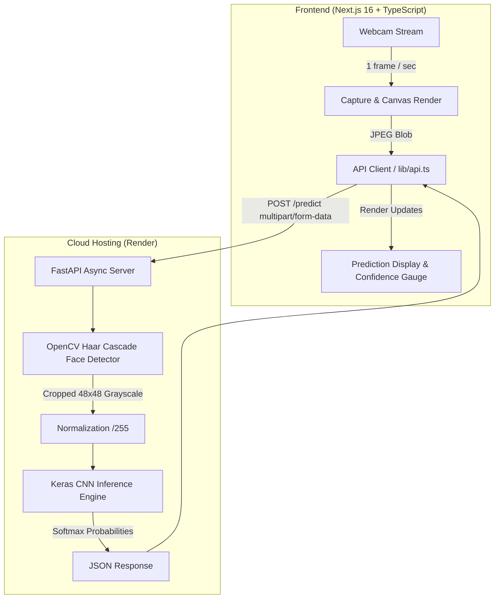

# 🧠 EmotionAI – Real-Time Facial Expression Recognition Platform

[](https://www.python.org/)
[](https://www.tensorflow.org/)
[](https://fastapi.tiangolo.com/)
[](https://nextjs.org/)
[](https://www.typescriptlang.org/)
[](https://tailwindcss.com/)
[](LICENSE)

An end-to-end, production-ready computer vision and deep learning platform for real-time facial expression recognition. Built with a custom **Convolutional Neural Network (CNN)** trained on a balanced **FER2013** dataset, served via an asynchronous **FastAPI** backend, and visualized through a modern, responsive **Next.js** dashboard.

---

## 🔗 Live Deployments

| Component | Platform | Status | URL |
|---|---|---|---|
| **Backend API** | Render |  | [emotion-detector-backend-26w2.onrender.com](https://emotion-detector-backend-26w2.onrender.com/health) |
| **Interactive API Docs** | Swagger / OpenAPI |  | [API Documentation](https://emotion-detector-backend-26w2.onrender.com/docs) |
| **Frontend Dashboard** | Vercel |  | *Deploying on Vercel* |

---

## ✨ Key Features

- **Real-Time Webcam Inference**: Client captures frames at 1 FPS, sending lightweight JPEG payloads to the backend with non-blocking async requests.
- **Automated Face Localization**: OpenCV Haar Cascade detects the primary face region and dynamically crops it with a 10% safety margin before preprocessing.
- **Balanced CNN Model (v0.2.0)**: Overcomes classic class-imbalance bias using 3,000 balanced images per class and dynamic augmentation, achieving **62.54% test accuracy** on FER2013 (human baseline is ~65%).
- **5 Emotion Classes**: Recognizes **Happy**, **Surprise**, **Neutral**, **Angry**, and **Sad** with high confidence.
- **Privacy-First Architecture**: Zero image retention. Frames are processed entirely in memory as byte streams and discarded immediately after prediction.
- **Modern Soft UI/UX**: Clean light theme designed without harsh dark gradients, featuring circular SVG confidence gauges and real-time per-class probability breakdowns.

---

## 🏛️ System Architecture



---

## 🔬 Model Performance & Benchmarks

The model was trained on a balanced subset of **FER2013** using randomized data augmentation (horizontal flip, small rotation, zoom, shift) over 25 epochs.

### Classification Metrics (Held-out Test Set)

| Emotion | Test Samples | Accuracy / Recall | Precision | F1-Score |
|---|---|---|---|---|
| **Happy 😊** | 1,774 | **86.0%** | 0.81 | 0.83 |
| **Surprise 😮** | 831 | **80.4%** | 0.74 | 0.77 |
| **Neutral 😐** | 1,233 | **68.0%** | 0.58 | 0.63 |
| **Angry 😠** | 958 | **38.5%** | 0.52 | 0.44 |
| **Sad 😢** | 1,247 | **30.4%** | 0.48 | 0.37 |
| **Overall Accuracy** | **6,043** | **62.54%** | **0.63** | **0.61** |

> **Ethical & Scientific Disclaimer**: This model classifies *visible facial muscle movements* based on standardized dataset annotations. It does not measure internal affective state, mental health, cognitive ability, or intent.

---

## 📂 Repository Structure

```
Emotion_Detector/
├── backend/                  # FastAPI Application
│   ├── app/
│   │   ├── api/routes.py     # Endpoints: /health, /model-info, /predict
│   │   ├── core/config.py    # Environment settings & CORS
│   │   ├── ml/inference.py   # OpenCV face detection & Keras predictor
│   │   ├── ml/loader.py      # Singleton thread-safe model loader
│   │   └── main.py           # FastAPI application entrypoint
│   ├── tests/                # Pytest suite (API & inference tests)
│   ├── requirements.txt      # Python dependencies (pinned for Linux/Render)
│   └── render.yaml           # Infrastructure-as-code for Render
│
├── frontend/                 # Next.js 16 Web Dashboard
│   ├── app/
│   │   ├── globals.css       # Soft UI tokens & responsive design
│   │   ├── layout.tsx        # SEO meta & HTML root
│   │   └── page.tsx          # Main dashboard container
│   ├── components/
│   │   ├── WebcamCapture.tsx # Browser camera streaming & frame sampling
│   │   ├── CameraControls.tsx# Start/Stop buttons & status pills
│   │   └── PredictionDisplay.tsx # Gauge meter & probability breakdown
│   ├── lib/                  # Typed API client & response types
│   └── package.json
│
├── ml/                       # Machine Learning Engineering Pipeline
│   ├── preprocessing/        # FER2013 extraction, filtering & normalization
│   ├── training/
│   │   ├── model.py          # 4-block CNN architecture definition
│   │   ├── train.py          # Standard training pipeline
│   │   └── train_balanced.py # Balanced sampling + online augmentation trainer
│   └── evaluation/           # Evaluation scripts & confusion matrix plotting
│
├── models/
│   ├── emotion_cnn.keras     # Trained model weights (tracked via Git LFS)
│   └── metadata.json         # Runtime metadata & benchmark metrics
└── .python-version           # Pinned to Python 3.11.9
```

---

## 🛠️ Local Development Setup

### Prerequisites
- **Python 3.10** or **3.11**
- **Node.js 18+** and **npm**
- **Git LFS** (`git lfs install`)

---

### 1. Clone the Repository
```bash
git clone https://github.com/AhmedMuarij/Emotion_Detector.git
cd Emotion_Detector
git lfs pull
```

---

### 2. Backend Setup
```bash
# Create virtual environment
python -m venv .venv

# Activate on Windows:
.venv\Scripts\activate
# Or on macOS/Linux:
# source .venv/bin/activate

# Install dependencies
pip install -r backend/requirements.txt

# Run FastAPI backend with live reload
cd backend
uvicorn app.main:app --reload --host 127.0.0.1 --port 8000
```
Backend will be available at `http://127.0.0.1:8000`.  
Swagger documentation is available at `http://127.0.0.1:8000/docs`.

---

### 3. Frontend Setup
In a new terminal:
```bash
cd frontend

# Install dependencies
npm install

# Create environment configuration
echo "NEXT_PUBLIC_API_BASE_URL=http://localhost:8000" > .env.local

# Run Next.js development server
npm run dev
```
Open **`http://localhost:3000`** in your browser.

---

### 4. Running Tests
To run backend unit and integration tests:
```bash
pytest backend/tests -v
```

---

## 📡 API Reference

### 1. Health Check
`GET /health`
```json
{
  "status": "ok",
  "model_loaded": true,
  "version": "0.2.0"
}
```

### 2. Model Metadata
`GET /model-info`
```json
{
  "model_name": "emotion_cnn",
  "model_version": "0.2.0",
  "num_classes": 5,
  "supported_expressions": ["Angry", "Happy", "Sad", "Surprise", "Neutral"],
  "input": {
    "height": 48,
    "width": 48,
    "channels": 1,
    "color_mode": "grayscale",
    "normalization": "divide_by_255"
  }
}
```

### 3. Expression Prediction
`POST /predict`  
**Content-Type:** `multipart/form-data`  
**Body:** `file`: `image/jpeg` or `image/png`

**Response:**
```json
{
  "face_detected": true,
  "prediction": {
    "label": "Happy",
    "confidence": 0.8645
  },
  "probabilities": {
    "Happy": 0.8645,
    "Neutral": 0.0821,
    "Surprise": 0.0312,
    "Sad": 0.0142,
    "Angry": 0.0080
  },
  "processing_time_ms": 18.4
}
```

---

## 🚀 Cloud Deployment

### Backend on Render
1. Connect your repository to [Render](https://render.com).
2. Create a new **Web Service** pointing to the repository.
3. Configure:
   - **Root Directory:** `backend`
   - **Runtime:** `Python 3`
   - **Build Command:** `pip install -r requirements.txt`
   - **Start Command:** `uvicorn app.main:app --host 0.0.0.0 --port $PORT`
   - **Environment Variables:**
     - `PYTHON_VERSION`: `3.11.9`
     - `CORS_ORIGINS`: `*` (or your frontend domain)
     - `MODEL_PATH`: `../models/emotion_cnn.keras`
     - `MODEL_METADATA_PATH`: `../models/metadata.json`

### Frontend on Vercel
1. Import repository on [Vercel](https://vercel.com).
2. Set **Root Directory** to `frontend`.
3. Add Environment Variable:
   - `NEXT_PUBLIC_API_BASE_URL`: `https://your-render-backend.onrender.com`
4. Click **Deploy**.

---

## 👤 Author

**Ahmed Muarij**  
- **GitHub:** [@AhmedMuarij](https://github.com/AhmedMuarij)
- **Project:** [Emotion_Detector](https://github.com/AhmedMuarij/Emotion_Detector)

---

## 📄 License

This project is licensed under the **MIT License** - see the [LICENSE](LICENSE) file for details.